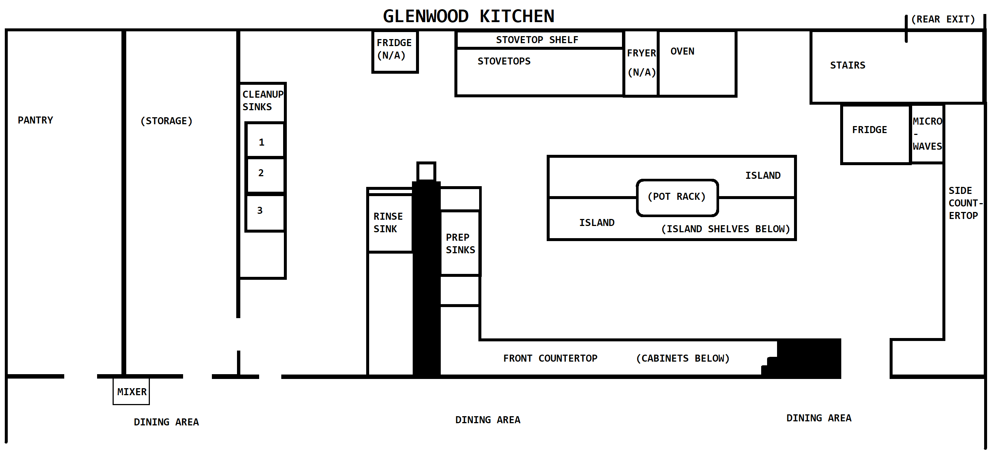

# Finding and storing things in the kitchen

## Storing cookware and dishes

### Cabinets

(Under the front countertop)

- silverware
- utensils
- cutting boards
- knives

### Pot rack

(Over the central island)

- masher
- colanders
- skillets
- large pots

### Island shelves

(Under the central island)

- cooking sheets
- oven pans
- mixing bowls (all varieties)
- trays
- pot lids
- cling wrap
- aluminum foil

### Storage

(To the left of the dishwashing room)

- plates and dishes for eating at the church
- cast iron skillets

### Pantry

- immersion blender
- Instant Pots
- grinder
- blender
